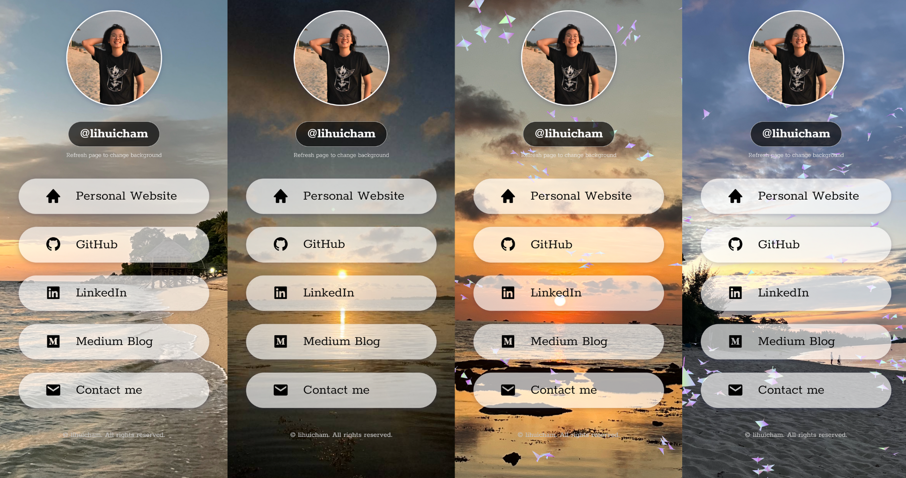

# Link in Bio 
Designed using HTML, CSS, JavaScript and Vanta.js.  
Inspired and learnt from [devaslife](https://youtu.be/u71pHOyvBp0).  

### Tools & Libraries 
- Font used: Rokkit (Google Fonts)
- 3D Animated Background Birds: [Vanta.js](https://www.vantajs.com/)  
<br>



### 3D Animated Background (Birds)
```
<script>
    // Run the script after the content is fully loaded 
    window.addEventListener('DOMContentLoaded', () => {
        VANTA.BIRDS({
            el: "#vanta",
            mouseControls: true,
            touchControls: true,
            gyroControls: false,
            minHeight: 200.00,
            minWidth: 200.00,
            scale: 1.00,
            scaleMobile: 1.00,
            color1: 0xbb61a0,
            color2: 0x17c1e5,
            speedLimit: 4.00,
            separation: 33.00,
            alignment: 12.00,
            cohesion: 10.00,
            backgroundAlpha: 0.0
        })
    })
    setTimeout(() => {
        const main = document.querySelector('main');
        main.style.opacity = 1
        main.style.filter = 'blur(0px)'
    }, 1000);

</script>

<div id="vanta"></div>
```
To use other 3D animated effects for background, visit [Vanta.js](https://www.vantajs.com/). You can customize the background effects (e.g. the color of the birds) in the website.  

Use ```backgroundAlpha: 0.0``` to remove the default background (create transparent background) and show only the animated effects (which are birds in my project). 

### Refresh to change background image 
```
<script>
    window.onload = function () {
        var images = ['./assets/background-images/b1.jpg', './assets/background-images/b2.jpg', './assets/background-images/b3.jpg', './assets/background-images/b4.jpg', 
                    './assets/background-images/b5.jpg', './assets/background-images/b6.jpg', './assets/background-images/b7.jpg', './assets/background-images/b8.jpg'];
        var image = images[Math.floor(Math.random() * images.length)];
        document.getElementsByTagName('body')[0].style.backgroundImage = "url('" + image + "')";
        document.getElementsByTagName('body')[0].style.backgroundRepeat = "no-repeat";
        document.getElementsByTagName('body')[0].style.backgroundPosition = "center center";
        document.getElementsByTagName('body')[0].style.backgroundAttachment = "fixed";
        document.getElementsByTagName('body')[0].style.backgroundSize = "cover";
    }
</script>
```
Create an array of images with background images in your asset. Use functions from the ```Math``` library such as ```Math.random()``` to randomize the order of the images.  

Check out this [page](https://www.w3schools.com/cssref/css3_pr_background.asp) by W3Schools on styling the CSS ```background``` property of the ```body``` DOM element. 

### Video in the background 
This part is commented out in the final project.   
To play video as background, ```.mp4``` and ```.webm``` video files are required.  
HTML: 
```
<video autoplay muted loop playsinline>
    <source src="./assets/bg-video-mp4.mp4" type="video/mp4; codecs=hvc1">
    <source src="./assets/bg-video-webm.webm" type="video/webm; codecs=vp9">
</video>
```
CSS: 
```
video {
    z-index: 0;
    position: absolute;
    left: 0;
    top: 0;
    width: 100%;
    height: 100%;
    object-fit: cover;
}
```

### Photo credits
All images including profile picture and background images are taken during a school trip to Bintan, Indonesia. I wrote a blog post about the trip, you can click [here](https://medium.com/@lihuicham/bintan-island-fdbcdcf94672) to read it !
All photo credits go to my friends who contributed the photos. Thank you ! 

<br>

Note: This Link In Bio project is best viewed on **mobile phone screen**.   
**Link In Bio: [Project Demo](https://lihuicham.github.io/linkinbio/)**


